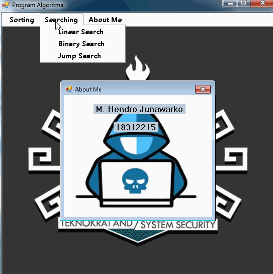

# Desktop_Sorting_and_Searching_Algorithm_GUI_Form

Kode Mata Kuliah: INF 121
Mata Kuliah: Algoritma Pemograman
Jumlah SKS: 2 SKS (2 -0)
Fakultas / Prodi: FTIK/Informatika
Dosen: Agus Mulyanto, S.Kom., M.T
Email	: agus.mulyanto@teknokrat.ac.id

 program  untuk melakukan pengurutan dan pencarian dengan menggunakan algoritma:
 
 Sorting Algorithm : 
 - Selection sort
 - Bubble sort
 - Insertion Sort
 - Quick Sort
 - Merge Sort
 
 Searching Algorithm :
 - Linear Search
 - Binary Search
 - Jump Search 
 
 
 

	
 
 referensi : 
 https://www.geeksforgeeks.org/sorting-algorithms/
 https://www.geeksforgeeks.org/searching-algorithms/
